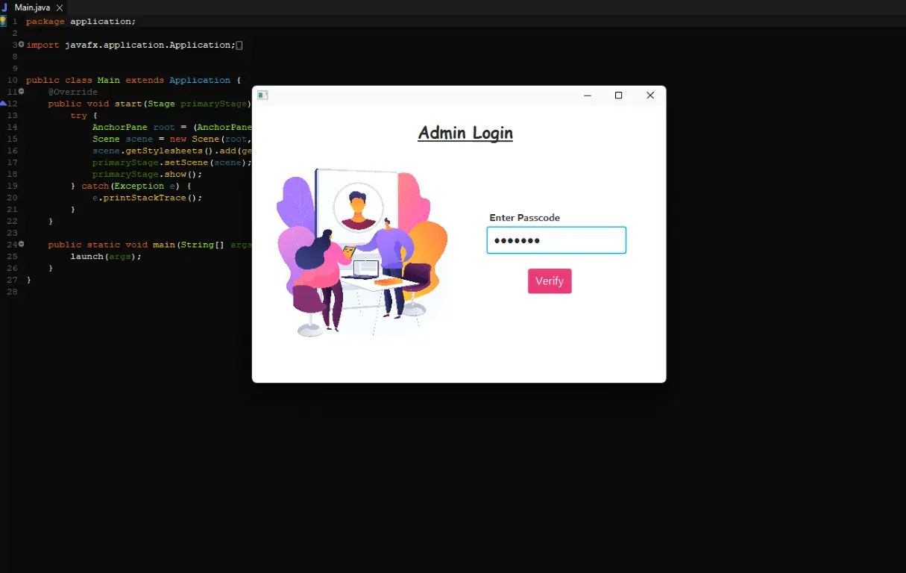

 
Just like every desktop software, it opens up as login page, where authentication is required. If the user fills up correct password then the followed pages get unlocked otherwise no one could access the further data.
 
 

<b> Login Page Preview</b>

next page to visit - <a href="./Page2.md">Admin Desk</a>
