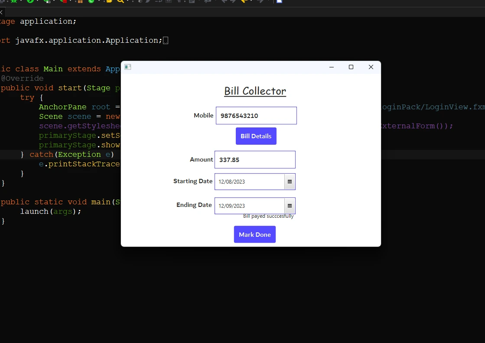

## Payment Collection Station

The Payment Collection Station empowers you to collect payments from customers with ease. After entering the mobile number and retrieving the data, user details are displayed to minimize the potential for errors. Once the payment is received, clicking the "Mark Done" button updates the payment status to "Done".

<b>Preview of Payment Collection</b>

<a href="./Page2.md"><b>Return to the Control Center</b></a>

