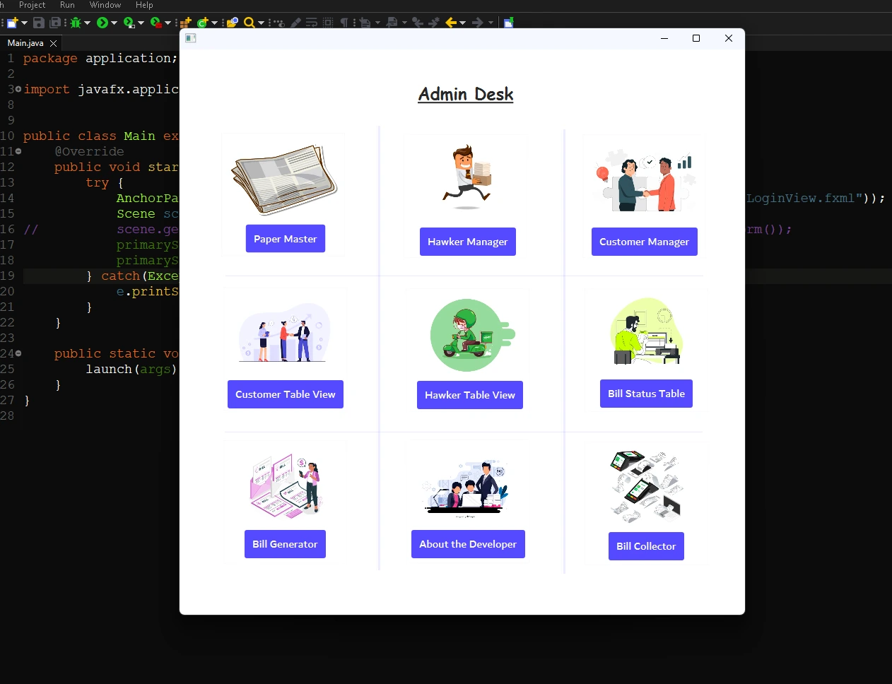

## Control Center: Administrative Hub

🎯 Step beyond the gates of verification into the heart of command – the Administrative Hub. Here, you gain access to a set of powerful tools that help you efficiently manage customers' newspaper preferences.

Discover a range of convenient options right at your fingertips:

* [Paper Management](./Page3.md)
* [Hawker Management](./Page4.md)
* [Customer Management](./Page5.md)
* [Customer Overview](./Page6.md)
* [Hawker Overview](./Page7.md)
* [Bill Status Check](./Page8.md)
* [Generate Bills](./Page9.md)
* [Collect Bills](./Page10.md)
* [Developer Info](./Page11.md)

Open the door to empowerment:

<b>Begin Your Journey of Impact</b>

<a href="./Page1.md"><b>Logout</b></a>

