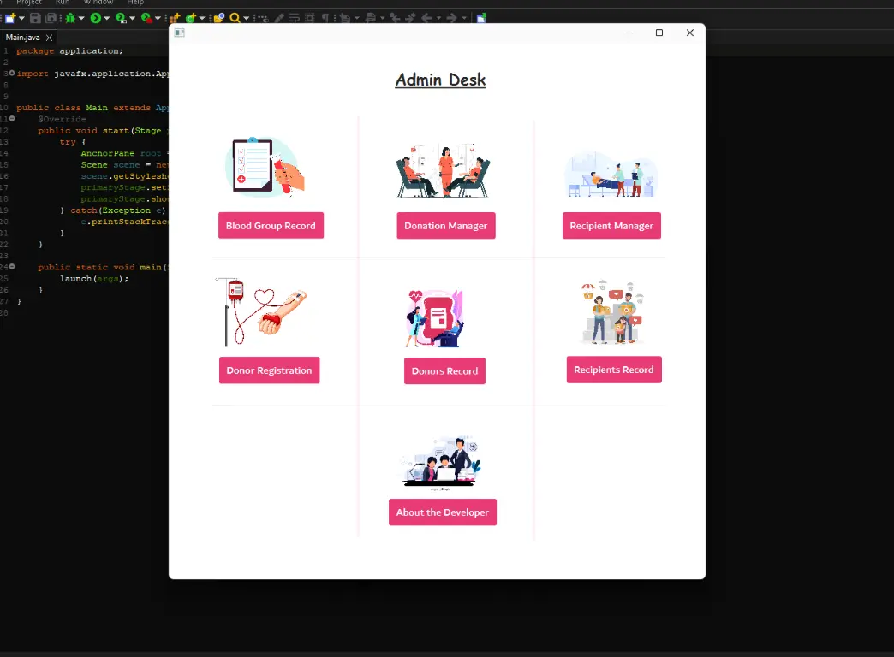

 
After authenticating the user who's going to use the data, the software opens up Admin Desk Page which has navigation to different operations to perform

here's the list for navigation available :-

* <a href="./Page3.md">Record tracking of Blood Units</a>
* <a href="./Page4.md">Instant Blood Donation</a>
* <a href="./Page5.md">Issuing Blood Instantly</a>
* <a href="./Page6.md">Registration for New Blood Donors</a>
* <a href="./Page7.md">Record of all Donations</a>
* <a href="./Page8.md">Record of all Recipients who have taken Blood</a>
* <a href="./Page9.md"><b>About the Developer</b></a>
 

<b> Admin Panel Preview
