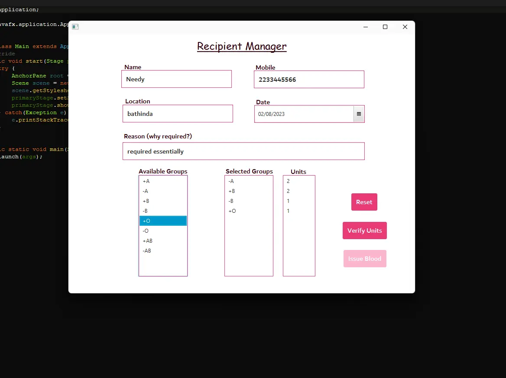
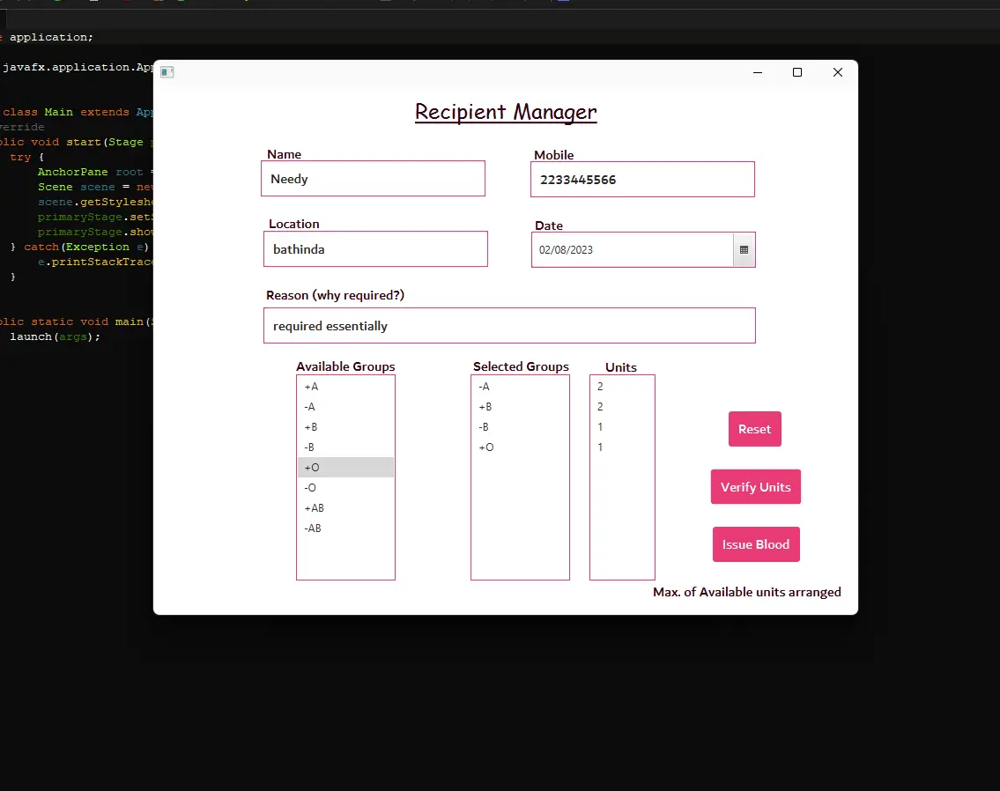

## Recipient Manager

 
This page handles the recipients record, for people who require blood units, or any other hospitals who require blood units for more than one patient, then this is handled easily here.

It firstly needs filling up all the details and requirements, then verification of units selected is done at which software checks from blood units whether the amount is available for further issuing, then the units are modified as required.

after that admin can issue the blood to recipient
 

After verification

<b>Recipient Manager Preview</b>

 

<a href="./Page2.md"><b>Back to Admin Desk</b></a>
 
