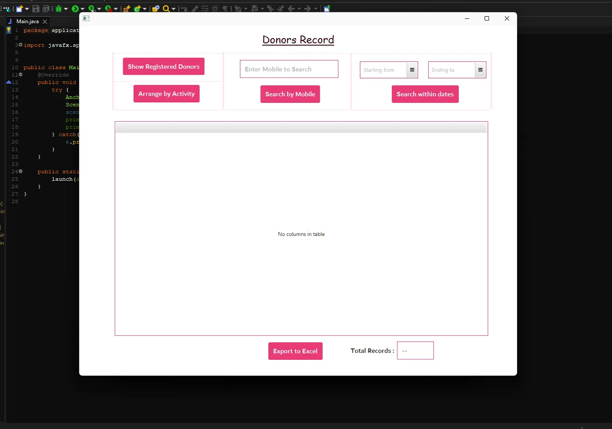

## Donor's Chronicles

📚 The Donations Record is a repository of stories etched in generosity, kindness, and the selfless act of giving life. Within its digital pages, every donor's journey is meticulously preserved, offering a panoramic view of their contributions.

### **Features**

1. **Parameterized Search:** Seamlessly search records based on diverse parameters, such as registered mobile number, days since the last donation, and more.

2. **Active Donor Insights:** Gain insights into the most active donors, forming a foundation of gratitude and acknowledgment.

3. **Effortless Data Export:** Empower administrators to extract the entire data table and export it to an Excel file for convenient viewing.

Experience the power of shared humanity:

_Witness the tale of giving unfold:_

<b>An Odyssey of Compassion</b>

<a href="./Page2.md"><b>Return to the Admin Desk</b></a>

