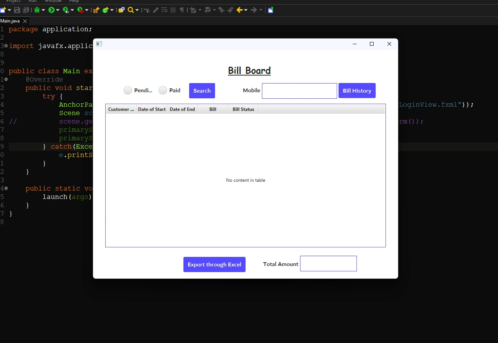
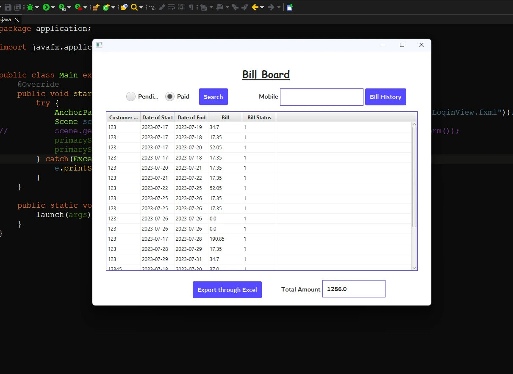

## Bill Status Overview

This page serves as a central hub for managing the revenue of our agency, providing insights into bill payment statuses and more.

### **Key Features**

1. **Strategic Search:** Admins can swiftly search records using parameters like registered mobile numbers and payment status.
2. **Effortless Data Export:** Empowers administrators to export the entire data table to an Excel file, streamlining data analysis.
3. **Total Amount:** Provides an aggregated view of the entire revenue in Rupees.

_After filling in details:_

<b>Preview of Bill Status Board</b>

<a href="./Page2.md"><b>Return to the Control Center</b></a>

