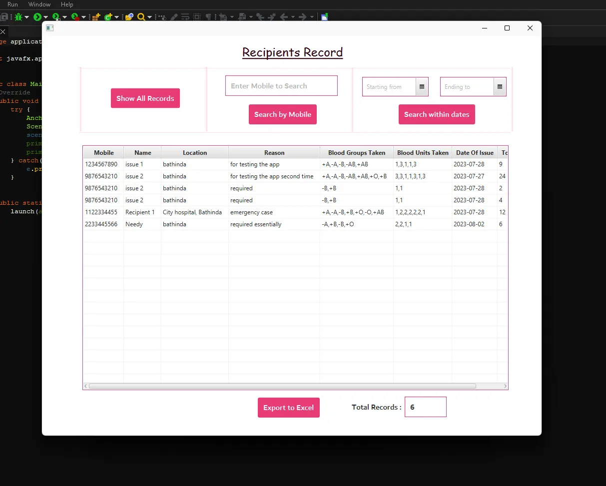

## Lifeline Chronicles

🩸 Within the precincts of the Blood Issue Record, a symphony of life-saving acts is meticulously composed. Every issued unit of blood encapsulates a story of compassion, resilience, and the pursuit of health. The repository ensures that these stories are never forgotten.

### **Features**

1. **Strategic Search:** Admins can search records based on various parameters, including registered mobile numbers and days since issue.

2. **Comprehensive Data:** Access records that reflect the interconnected threads of life-saving endeavors.

3. **Effortless Data Export:** Empower administrators to export the entire data table to an Excel file for simplified viewing.

Dive into the symphony of life renewal:

<b>A Tapestry of Renewal</b>

<a href="./Page2.md"><b>Return to the Admin Desk</b></a>

