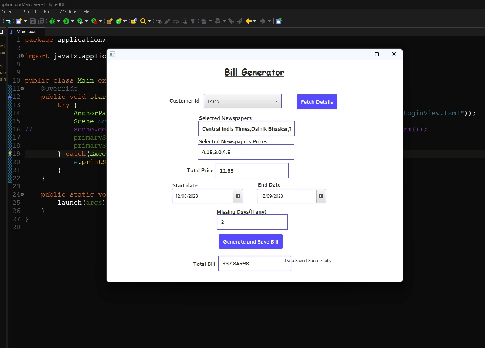

## Bill Generation Portal

The Bill Generation Portal facilitates the creation of bill records for users by utilizing their mobile numbers. This process ensures that user details are accurately presented, minimizing potential errors. After selecting the end date and indicating any days when newspaper delivery was missed, the software automatically calculates the total bill amount.

<a href="./Page2.md"><b>Return to the Control Center</b></a>

